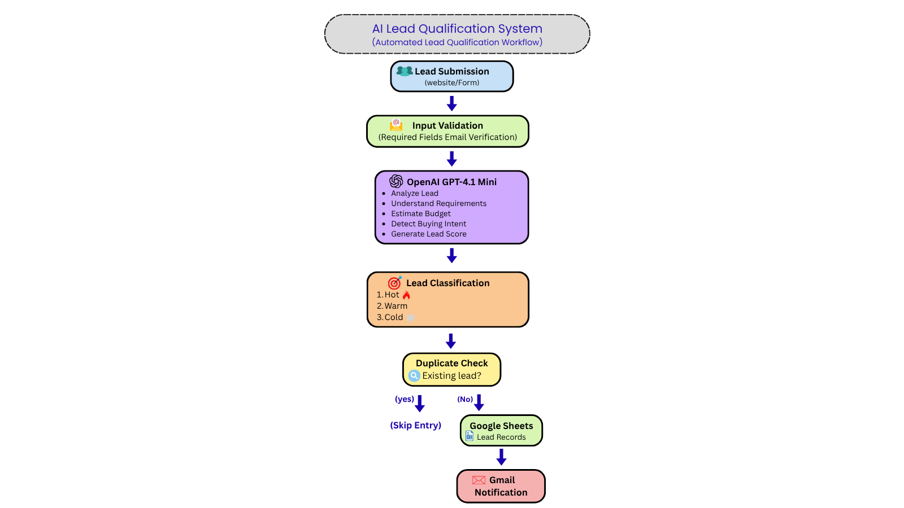
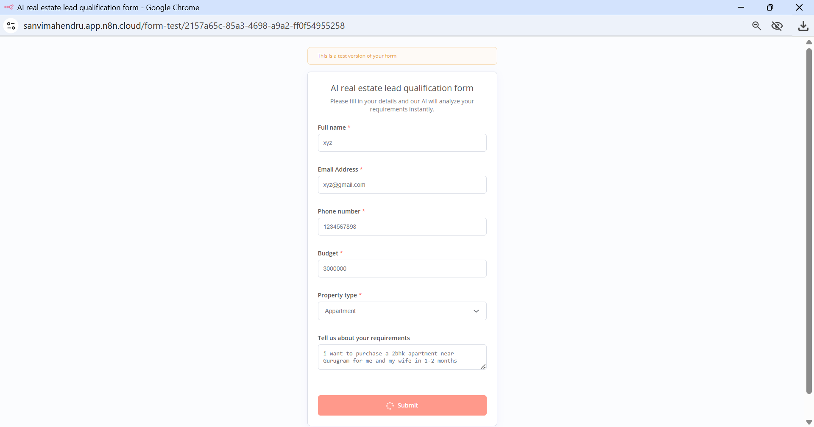
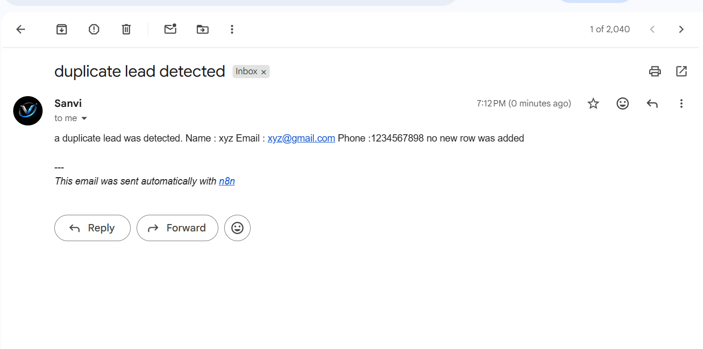
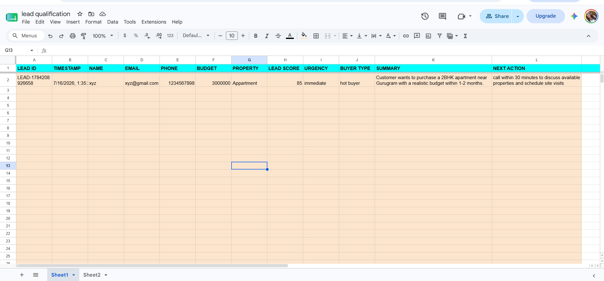
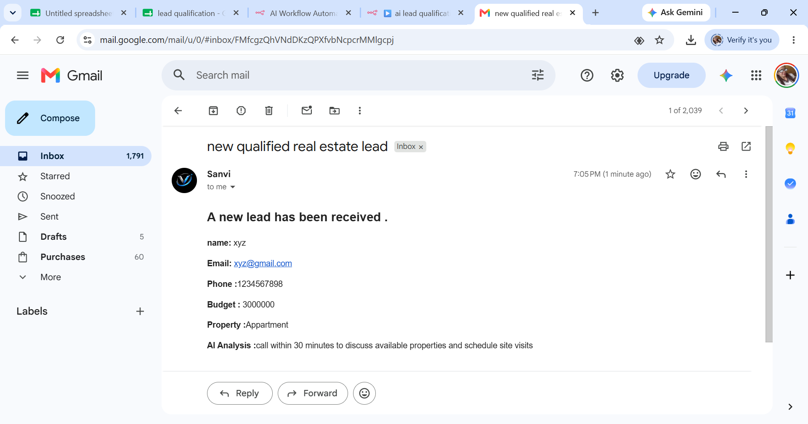

# 🤖 AI Lead Qualification & CRM Automation System 

> **An AI-powered Lead Qualification System built with n8n, OpenAI GPT-4.1 Mini, Google Sheets, and Gmail to automatically analyze, score, classify, and manage real estate leads for sales teams.**

---

## 🌍 Project Overview

Real estate businesses receive hundreds of inquiries every week. Manually reviewing each lead, identifying serious buyers, maintaining CRM records, and notifying the sales team is time-consuming and often leads to delayed responses and missed opportunities.

This project demonstrates an end-to-end **AI-powered Lead Qualification & CRM Automation System** that intelligently processes incoming leads, evaluates buying intent using OpenAI, categorizes prospects into Hot, Warm, or Cold buyers, prevents duplicate entries, stores qualified leads in Google Sheets CRM, and instantly notifies the sales team through Gmail.

The workflow is built using **n8n**, making it scalable, modular, and easy to integrate with existing business systems.

---

# 🎯 Business Problem

Most real estate companies still qualify leads manually.

This creates several operational challenges:

- Sales teams waste time reviewing every inquiry.
- Duplicate leads create clutter inside CRM systems.
- High-quality buyers are often contacted too late.
- Sales representatives spend valuable time following up with low-intent prospects.
- Manual CRM updates increase the chances of human error.
- Delayed responses reduce conversion rates.

As lead volume grows, these inefficiencies directly affect business performance and revenue.

---

# 💡 Solution

This workflow automates the complete lead qualification process.

Instead of relying on manual review, every submitted lead is automatically processed through an AI-powered decision pipeline.

The workflow:

- Captures customer information from an online form
- Validates required fields
- Uses OpenAI GPT-4.1 Mini to analyze buyer intent
- Calculates an AI Lead Score
- Classifies the buyer as Hot, Warm, or Cold
- Detects duplicate leads
- Stores qualified leads in Google Sheets CRM
- Sends instant email notifications to the sales team
- Recommends the next sales action for faster follow-up

The result is a faster, more intelligent, and scalable lead management system.

---

# ✨ Key Features

### 🤖 AI Lead Qualification

Automatically evaluates every lead using OpenAI GPT-4.1 Mini based on:

- Budget realism
- Buying intent
- Purchase timeline
- Property type
- Customer requirements

---

### 📊 AI Lead Scoring

Every lead receives an AI-generated score between **0–100**, helping sales teams prioritize follow-ups.

Example:

| Score | Priority |
|--------|----------|
| 80–100 | High Priority |
| 60–79 | Medium Priority |
| 40–59 | Low Priority |
| 0–39 | Poor Quality |

---

### 🔥 Intelligent Buyer Classification

The workflow automatically classifies customers as:

- 🔥 Hot Buyer
- 🌤️ Warm Buyer
- ❄️ Cold Buyer

This enables sales representatives to focus on the highest-value prospects first.

---

### ⚡ Duplicate Lead Detection

Before saving data into the CRM, the workflow checks Google Sheets using the customer's email address.

If the lead already exists:

- Duplicate entry is prevented.
- CRM remains clean.
- Sales teams avoid contacting the same prospect multiple times.

---

### 📋 Automated CRM Management

Qualified leads are automatically stored inside Google Sheets CRM with important information including:

- Lead ID
- Timestamp
- Name
- Email
- Phone Number
- Budget
- Property Type
- AI Lead Score
- Urgency
- Buyer Type
- AI Summary
- Recommended Next Action

---

### 📧 Instant Sales Notifications

Whenever a qualified lead is detected, the workflow automatically sends an email notification containing:

- Customer Details
- Contact Information
- Budget
- Property Preference
- AI Recommendation
- Suggested Next Action

This allows the sales team to respond immediately.

---

### 🧠 AI Recommendations

Instead of only storing customer data, the AI also recommends actionable next steps such as:

- Call within 30 minutes
- Schedule a property visit
- Verify customer budget
- Discuss available listings

This assists sales representatives in making faster and more informed decisions.

---

# 🏗 Workflow Architecture

The workflow follows the automation pipeline below:

```text
Lead Submission
        │
        ▼
Input Validation
        │
        ▼
OpenAI GPT-4.1 Mini Analysis
        │
        ▼
AI Lead Scoring
        │
        ▼
Buyer Classification
        │
        ▼
Duplicate Detection
      ┌──┴──┐
      │     │
 Duplicate  New Lead
   Found       │
 Skip Entry    ▼
         Google Sheets CRM
                │
                ▼
      Gmail Sales Notification
```

---

## 📌 Workflow Diagram

```markdown

```

---

# 🚀 Business Benefits

This automation helps real estate businesses:

- Reduce manual lead qualification
- Improve response time
- Eliminate duplicate CRM entries
- Prioritize serious buyers automatically
- Improve sales productivity
- Increase conversion opportunities
- Maintain organized customer records
- Deliver AI-assisted recommendations to sales representatives

---

# 🛠 Tech Stack

| Technology | Purpose |
|------------|----------|
| **n8n** | Workflow Automation |
| **OpenAI GPT-4.1 Mini** | AI Lead Analysis |
| **Google Sheets** | CRM Database |
| **Gmail** | Email Notifications |
| **JSON** | Structured AI Response |
| **AI Prompt Engineering** | Lead Qualification Logic |

---

# 📂 Project Structure

```text
AI-Lead-Qualification-System/
│
├── workflow/
│   └── AI-Lead-Qualification-System.json
│
├── screenshots/
│   ├── workflow-architecture.png
│   ├── n8n-workflow.png
│   ├── lead-form.png
│   ├── crm-google-sheets.png
│   ├── gmail-notification.png
│   └── duplicate-detection.png
│
├── README.md
│
└── LICENSE
```

---
# ⚙️ Workflow Breakdown

The automation follows a structured AI-powered pipeline that transforms raw customer inquiries into qualified sales opportunities with minimal human intervention.

---

# Step 1 — Lead Capture

The workflow begins when a customer submits the **AI Real Estate Lead Qualification Form**.

The form collects all important customer information required for qualification.

### Information Collected

- Full Name
- Email Address
- Phone Number
- Budget
- Property Type
- Customer Requirements

This ensures that every lead contains sufficient information before entering the qualification process.

### Screenshot



---

# Step 2 — Data Validation

After submission, the workflow validates the incoming information before sending it to the AI model.

Validation includes:

- Required field verification
- Email availability
- Data structure formatting
- Missing information detection

Invalid or incomplete submissions are automatically filtered, ensuring that only usable data enters the workflow.

---

# Step 3 — AI Lead Analysis

Once validation is complete, the workflow sends the customer information to **OpenAI GPT-4.1 Mini** for intelligent analysis.

Unlike traditional workflows that simply store customer information, this workflow evaluates the lead using contextual reasoning.

The AI analyzes:

- Customer budget
- Property preference
- Purchase timeline
- Buying intent
- Customer message
- Overall qualification

Based on this information, the AI produces a structured JSON response.

---

## AI Evaluation Logic

The AI evaluates every lead according to predefined business rules.

### High Quality Leads (80–100)

- Realistic property budget
- Purchase expected within 3 months
- Strong buying intent

---

### Medium Quality Leads (60–79)

- Acceptable budget
- Purchase expected within 3–12 months
- Moderate buying intent

---

### Low Quality Leads (40–59)

- Budget is incomplete or relatively low
- Purchase planned after one year
- Customer is still exploring options

---

### Poor Quality Leads (0–39)

- Unrealistic property budget
- Fake or incomplete information
- No clear buying intent

This scoring system enables the sales team to prioritize serious buyers instead of manually reviewing every inquiry.

---

# Step 4 — AI Generated Insights

The AI returns structured JSON containing valuable sales intelligence.

Example outputs include:

- Lead Score
- Buyer Type
- Urgency
- Summary
- Recommended Next Action
- Conversion Priority

Example:

```json
{
  "lead_score": 85,
  "urgency": "High",
  "buyer_type": "Hot Buyer",
  "summary": "Customer wants to purchase a 2BHK apartment within 2 months.",
  "next_action": "Call within 30 minutes."
}
```

Returning structured JSON allows downstream automation nodes to process the data efficiently without additional parsing logic.

---

# Step 5 — Lead Classification

After the AI response is generated, the workflow classifies each lead into one of three categories.

| Buyer Type | Description |
|------------|-------------|
| 🔥 Hot Buyer | High buying intent with realistic budget and immediate timeline |
| 🌤️ Warm Buyer | Moderate interest with acceptable budget and medium-term purchase plan |
| ❄️ Cold Buyer | Low buying intent, unrealistic budget, or exploratory inquiry |

This allows the sales team to focus first on customers with the highest probability of conversion.

---

# Step 6 — Duplicate Lead Detection

Before saving customer information, the workflow checks the CRM using the customer's email address.

If an existing record is found:

- Duplicate entry is prevented
- CRM remains clean
- Sales team avoids repeated follow-ups

If no duplicate exists:

The workflow continues to CRM storage.

### Benefits

- Improved CRM quality
- Reduced manual cleanup
- Better reporting accuracy
- Faster sales operations

### Screenshot



---

# Step 7 — CRM Automation

Qualified leads are automatically stored inside **Google Sheets**, which acts as a lightweight CRM database.

Each record contains AI-generated insights alongside customer information.

### CRM Fields

- Lead ID
- Timestamp
- Name
- Email
- Phone Number
- Budget
- Property Type
- Lead Score
- Urgency
- Buyer Type
- AI Summary
- Recommended Next Action

This provides sales representatives with complete customer context before making contact.

### Screenshot



---

# Step 8 — Instant Sales Notification

After storing the qualified lead, the workflow automatically sends an email notification to the sales team.

The email contains:

- Customer Name
- Contact Details
- Budget
- Property Preference
- AI Summary
- Recommended Follow-up Action

This enables sales representatives to respond immediately without opening the CRM.

### Screenshot



---

# Complete Workflow

The entire automation executes within seconds.

```text
Customer submits lead
          │
          ▼
Input Validation
          │
          ▼
OpenAI Lead Analysis
          │
          ▼
Lead Score Generation
          │
          ▼
Buyer Classification
          │
          ▼
Duplicate Detection
      ┌──────────────┐
      │              │
Duplicate        New Lead
Detected            │
Skip Save           ▼
              Google Sheets CRM
                     │
                     ▼
          Gmail Notification
                     │
                     ▼
          Sales Team Follow-up
```

---

# Why This Workflow Matters

This project demonstrates how AI can automate repetitive sales operations while improving lead quality and response speed.

### Business Value

✅ Eliminates manual lead qualification

✅ Prioritizes high-intent buyers

✅ Prevents duplicate CRM entries

✅ Provides AI-assisted sales recommendations

✅ Reduces administrative workload

✅ Improves response time

✅ Organizes customer data automatically

✅ Creates a scalable lead management process

---

# Real-World Use Cases

Although designed for real estate businesses, this workflow can be adapted for many industries.

Examples include:

- Real Estate Agencies
- Property Management Companies
- Insurance Agencies
- Mortgage Brokers
- Automobile Dealerships
- Financial Services
- Education Admissions
- Healthcare Consultation Booking
- B2B Sales Teams
- Marketing Agencies

 # 🚀 Installation Guide

Follow the steps below to set up the workflow in your own n8n environment.

---

## Prerequisites

Before importing the workflow, ensure you have access to:

- n8n (Self-hosted or Cloud)
- OpenAI API Key
- Google Account
- Gmail Account
- Google Sheets
- Internet Connection

---

## Step 1 — Clone the Repository

```bash
git clone https://github.com/sanvi-builds/AI-Lead-Qualification-System.git
```

---

## Step 2 — Import the Workflow

1. Open your n8n workspace.
2. Click **Import Workflow**.
3. Select:

```
workflow/AI-Lead-Qualification-System.json
```

4. Save the workflow.

---

## Step 3 — Configure Credentials

Connect the required credentials:

### OpenAI

- Create an OpenAI API Key.
- Add it to your OpenAI Credential inside n8n.

---

### Gmail

Authorize your Gmail account using OAuth.

This account will send AI-generated sales notifications.

---

### Google Sheets

Connect your Google account.

Select the CRM spreadsheet where qualified leads will be stored.

---

## Step 4 — Test the Workflow

Submit a sample lead through the lead form.

The workflow should:

- Validate the information
- Analyze the lead using AI
- Classify the buyer
- Check for duplicates
- Store the lead in Google Sheets
- Send a Gmail notification

---

# 🔐 Required Credentials

The following credentials are required.

| Service | Purpose |
|----------|----------|
| OpenAI | AI Lead Analysis |
| Gmail | Sales Notifications |
| Google Sheets | CRM Database |

---

# 📁 Repository Structure

```
AI-Lead-Qualification-System
│
├── workflow
│   └── AI-Lead-Qualification-System.json
│
├── screenshots
│   ├── workflow-architecture.png
│   ├── workflow-overview.png
│   ├── lead-form.png
│   ├── crm-google-sheets.png
│   ├── gmail-notification.png
│   └── duplicate-detection.png
│
├── README.md
│
└── LICENSE
```

---

# 📈 Workflow Benefits

Compared with a manual lead qualification process, this automation provides:

| Manual Process | AI Automation |
|----------------|---------------|
| Manual Lead Review | Automated AI Analysis |
| Slow Response Time | Instant Processing |
| Manual CRM Updates | Automatic CRM Storage |
| Duplicate Entries | Duplicate Prevention |
| Manual Prioritization | AI Lead Scoring |
| Human Decision Making | AI-Assisted Recommendations |

---

# 🔮 Future Improvements

This workflow can be extended with additional enterprise features.

Future roadmap includes:

- HubSpot CRM Integration
- Salesforce Integration
- WhatsApp Notifications
- SMS Alerts
- Voice AI Agent
- Multi-language Support
- AI Appointment Booking
- Analytics Dashboard
- Follow-up Email Automation
- Property Recommendation Engine
- Calendar Scheduling
- Lead Assignment to Sales Representatives

---

# 💼 Business Value

This solution enables businesses to:

- Respond to customers faster
- Improve sales productivity
- Reduce manual administrative work
- Prioritize high-quality leads
- Maintain organized CRM records
- Deliver consistent lead qualification
- Increase operational efficiency
- Scale lead management without increasing manual effort

---

# 👨‍💻 About the Project

This project was developed as a portfolio demonstration of how Artificial Intelligence and workflow automation can streamline lead management for real estate businesses.

The objective was to create a scalable automation capable of analyzing customer inquiries, qualifying leads intelligently, maintaining CRM records, and assisting sales teams with actionable insights.

The workflow emphasizes automation, modular design, and practical business applications.

---

# 🌐 About Vexloria AI

**Vexloria AI** is focused on building intelligent automation systems that help businesses eliminate repetitive work through Artificial Intelligence.

Core areas of expertise include:

- AI Automation
- AI Agents
- Workflow Automation
- CRM Automation
- Lead Qualification Systems
- Voice AI Solutions
- Business Process Automation

The goal is to help businesses improve operational efficiency while delivering faster and smarter customer experiences.

---

# 📬 Contact

**Developer**

**Sanvi Mahendru**

Founder — **Vexloria AI**

For collaboration, project discussions, or business inquiries, feel free to connect through GitHub or instagram.

**Email:** sanvivexloria@gmail.com

**Instagram:** https://instagram.com/vexloria.ai

---

# ⭐ If You Found This Project Helpful

If you found this project useful or inspiring, consider giving it a ⭐ on GitHub.

Your support helps motivate future AI automation projects.

---

# 📄 License

This project is licensed under the **MIT License**.

You are free to use, modify, and distribute this project in accordance with the terms of the license.

---

# 🙏 Acknowledgements

Special thanks to the open-source community and the teams behind:

- n8n
- OpenAI
- Google Sheets
- Gmail

for providing the technologies that made this project possible.

---

> **Built with ❤️ using Artificial Intelligence, Workflow Automation, and OpenAI.**

## Feedback 
Feedback and suggestions are always welcome.
If you have ideas to improve this workflow or would like to discuss AI automation solutions, feel free to reach out through Instagram or Email.
